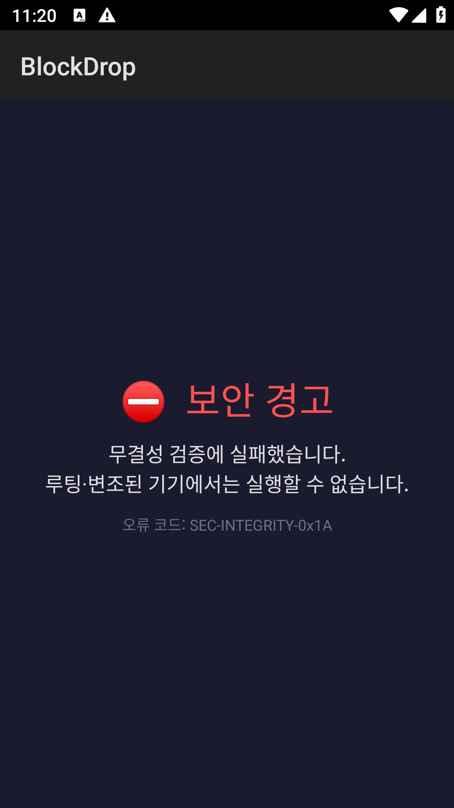
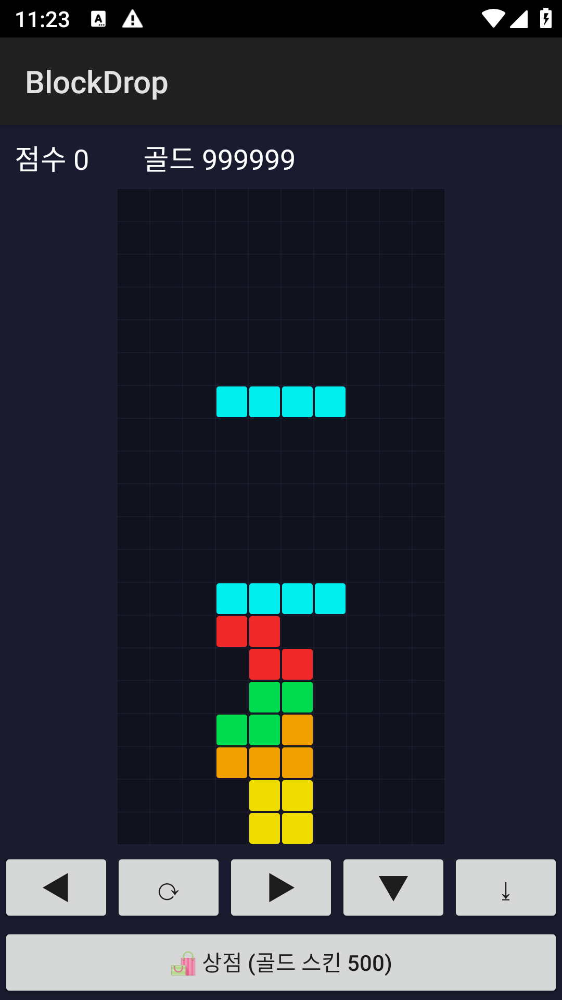
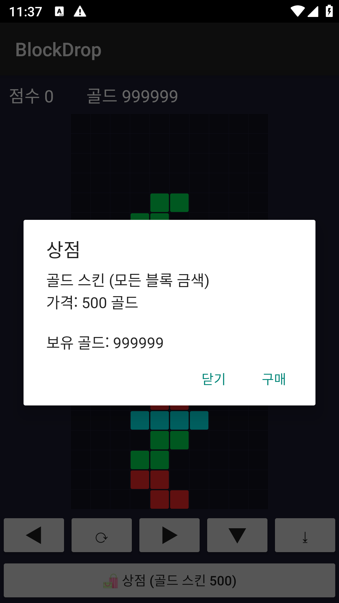
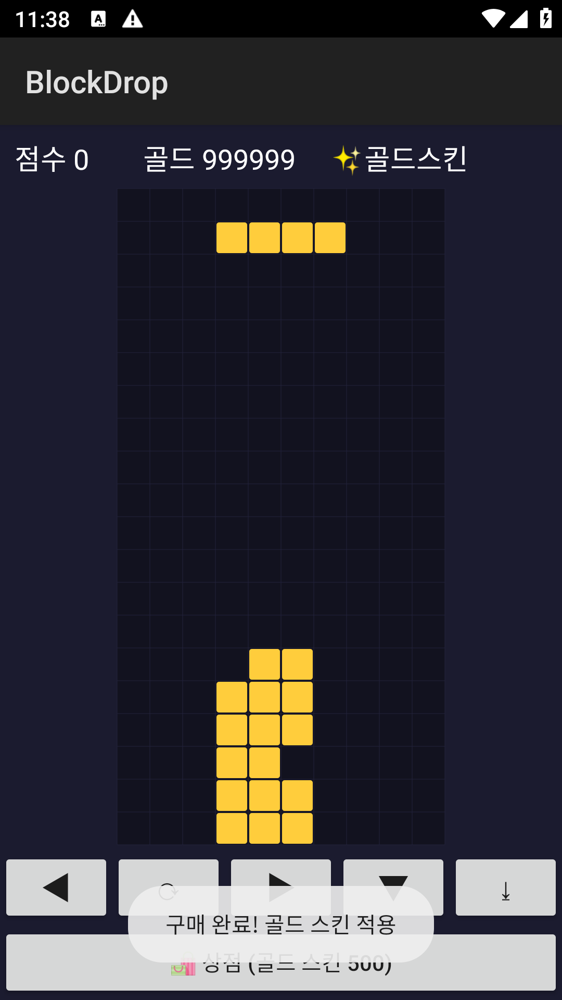

# BlockDrop — 모바일 게임 리버싱 실습 타깃 (루팅 우회 → 재화 조작)

> **교육용 취약 앱(intentionally-vulnerable lab).** 클라이언트 사이드 신뢰(client-side trust) 취약점을 직접 재현하고, jadx 정적 분석 + Frida 동적 계측으로 **① 루팅 탐지 우회 → ② 인게임 골드 조작**까지 이어지는 킬체인을 학습하기 위한 순수 Java(Android Canvas) 테트리스 게임입니다.
>
> ⚠️ 학습·포트폴리오 목적입니다. 본인이 만든/소유한 기기에서만 실습하세요. 타인의 앱·서비스 대상 무단 분석은 불법입니다.

| 루팅 차단(정상 방어) | 루팅 우회 + 골드 조작 | 상점: 조작된 잔액 | 무한 구매 결과 |
|---|---|---|---|
|  |  |  |  |

---

## 1. 앱 개요

- **패키지**: `com.reversinglab.blockdrop`
- **구성**: 순수 Java + `android.graphics.Canvas` 로 만든 테트리스. Flutter/Unity 아님 → **jadx 로 소스가 그대로 보임(난독화 없음)**.
- **게임성**: 블록 낙하·회전·줄 삭제. **줄을 지우면 골드 획득**, 상점에서 500 골드로 "골드 스킨" 구매.
- **의도된 취약점 2종** (둘 다 *클라이언트 온-디바이스 판정* — 서버 검증 없음):
  1. **루팅 탐지** `SecurityCheck.isDeviceRooted()` → `boolean`
  2. **재화(골드)** `Wallet.getGold()` → `int`

## 2. 취약점 분석 (블랙박스 관점)

소스가 없다고 가정하고, **APK만** 가지고 jadx 로 분석하는 흐름입니다.

### 2-1. 루팅 게이트 — `SecurityCheck.isDeviceRooted()`

앱을 켜면 루팅된 기기에서 "보안 경고 — 무결성 검증 실패" 화면이 뜨고 **막힙니다(탈출 버튼 없음)**. jadx 로 진입점을 따라가면:

```java
// MainActivity.onCreate (jadx)
if (SecurityCheck.isDeviceRooted()) {
    setContentView(buildBlockScreen());   // 차단
} else {
    startActivity(BlockDropActivity ...);  // 게임 진입
}
```

`SecurityCheck` 를 열면 판정은 **su/busybox 파일 존재 + test-keys 태그** 검사 후 `boolean` 하나로 압축됩니다.

```java
public static boolean isDeviceRooted() {
    for (String p : SU_PATHS) if (new File(p).exists()) return true;  // su 존재
    if (Build.TAGS != null && Build.TAGS.contains("test-keys")) return true;
    return false;
}
```

→ **후킹 지점 = `isDeviceRooted()` 의 반환값.** 이걸 `false` 로 만들면 게이트 통과.

### 2-2. 재화 — `Wallet.getGold()`

골드는 **메모리의 `int`** 이고, 상점 구매의 잔액 확인도 `getGold()` 를 통합니다:

```java
public static int getGold() { return gold; }
public static boolean spend(int amount) {
    if (getGold() >= amount) { gold -= amount; return true; }  // 잔액 확인 = getGold()
    return false;
}
```

→ **후킹 지점 = `getGold()`.** 큰 값을 돌려주면 표시 골드 + 모든 구매가 통과(무한 재화).

## 3. 익스플로잇 — Frida 런타임 후킹

> **Frida 17 주의:** 전역 `Java` 브리지가 코어에서 제거됨. 그냥 `Java.perform` 쓰면 `ReferenceError: 'Java' is not defined`. → `import Java from "frida-java-bridge"` 후 **frida-compile 로 번들링**해야 함. (`frida/blockdrop_hook.js` 는 이미 컴파일된 결과)

```js
// frida/blockdrop_hook_src.js  (초보용: boolean/int 반환값만 뒤집는 헬로월드 패턴)
import Java from "frida-java-bridge";
globalThis.Java = Java;

Java.perform(function () {
    var PKG = "com.reversinglab.blockdrop";

    // ① 루팅 우회
    Java.use(PKG + ".SecurityCheck").isDeviceRooted.implementation = function () {
        return false;
    };
    // ② 골드 조작
    Java.use(PKG + ".Wallet").getGold.implementation = function () {
        return 999999;
    };
});
```

### 실행

```bash
# 1) 기기에 frida-server 기동 (예: 루팅 에뮬레이터)
adb shell "su -c 'setsid /data/local/tmp/frida-server -l 0.0.0.0:27043 </dev/null >/dev/null 2>&1 &'"
adb forward tcp:27043 tcp:27043

# 2) (필요시) 훅 재컴파일
npx frida-compile frida/blockdrop_hook_src.js -o frida/blockdrop_hook.js

# 3) spawn 으로 후킹 (★ 루팅체크가 onCreate 초반에 돌므로 attach 아님 -f spawn)
frida -H 127.0.0.1:27043 -f com.reversinglab.blockdrop -l frida/blockdrop_hook.js
#   또는: python frida/driver_blockdrop.py
```

**결과**: 차단 화면을 건너뛰고 게임 진입 + 골드 999,999 → 상점에서 스킨 무한 구매.

## 4. 빌드 (gradle 없이)

`javac → d8 → aapt2 → zipalign → apksigner` 수동 체인. (Windows/PowerShell)

```powershell
./build.ps1        # 산출물: BlockDrop.apk (~16 KB)
adb install -r BlockDrop.apk
```

## 5. 근본 원인과 방어

| 취약점 | 근본 원인 | 방어 |
|---|---|---|
| 루팅 우회 | 무결성 판정이 **클라이언트에서만** 일어남 | 서버측 원격검증(**Play Integrity API** 등), 판정 로직을 클라이언트에 두지 않음 |
| 골드 조작 | 재화가 **클라이언트 상태**(권위 없음) | **서버 권위 경제**(잔액·구매를 서버가 소유), 클라는 표시만. 결제 검증은 서버 영수증 |

> 핵심 교훈: **클라이언트에서 내려주는 boolean/int 는 신뢰할 수 없다.** 온-디바이스 검사는 "장애물"일 뿐 "경계"가 아니다. 진짜 경계는 서버다.

## 6. 파일 구조

```
BlockDrop/
├─ src/com/reversinglab/blockdrop/
│  ├─ MainActivity.java        # 루팅 게이트
│  ├─ SecurityCheck.java       # ★ 루팅 탐지(후킹 대상)
│  ├─ Wallet.java              # ★ 골드(후킹 대상)
│  ├─ GameView.java            # Canvas 테트리스
│  └─ BlockDropActivity.java   # 게임 + 상점
├─ frida/
│  ├─ blockdrop_hook_src.js    # 훅 소스
│  ├─ blockdrop_hook.js        # 컴파일된 훅(바로 실행 가능)
│  └─ driver_blockdrop.py      # spawn 드라이버
├─ AndroidManifest.xml
├─ build.ps1                   # 원커맨드 빌드
└─ BlockDrop.apk               # 서명된 산출물
```

---

*모바일 앱 보안 · 리버싱 학습용 개인 프로젝트. 실제 서비스/타인 앱 대상 사용 금지.*
